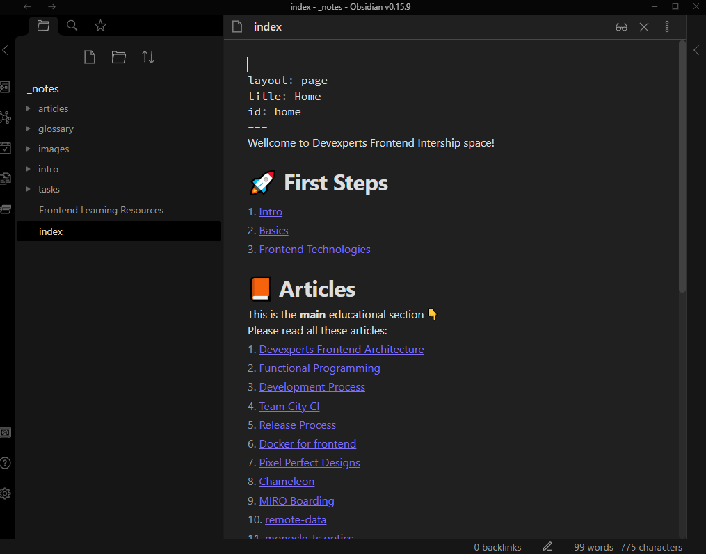

Github CI: https://alexeymatveevp.github.io/devexperts-fe-internship/  
Netlify CI: https://regal-trifle-1e28f9.netlify.app/ 

# Devexperts Frontend Internship
Educational pages for Devexperts company internship program for FE developers 🏆

Follow this tutorial:  
https://maximevaillancourt.com/blog/setting-up-your-own-digital-garden-with-jekyll

Install **Ruby** and start **jekyll**
```bash
bundle
bundle exec jekyll serve
```

## How to contribute
The pages are located in `_notes` folder. They are `.md` files with 1 little enhancement - **wiki-links** which are `[[link]]` format

You can edit them in any editor, but the preffered one is [obsidian](https://obsidian.md/) 

Download obsidian and open `_notes` folder as **vault**

Quick tricks:
- use `Ctrl+Enter` to follow links
- use `Ctrl+Alt+arrows` to move forward / backward to where you were
- use `Ctrl+O` to search for articles
- just type `[[` and obsidian will help you to link your pages
- configure `images` folder as **attachments folder** and paste screenshots with `Ctrl+V`

Try obsidian! It's very cool and an easy way to maintain this repo.

