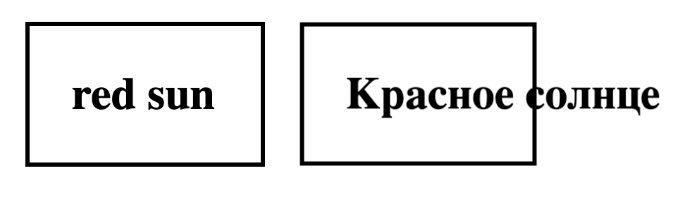
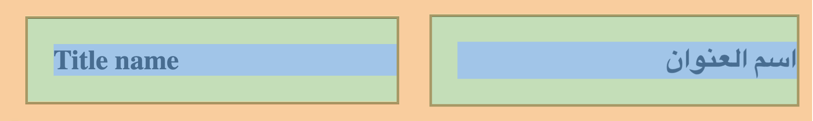

## Что такое Flexible Pixel Perfect?

Flexible Pixel Perfect - это подход, который использует в основе [[Pixel Perfect]], но идет немного дальше, сохраняя возможность верстки адаптироваться в зависимость от содержимого или окружения компонента.

Для верстки рекомендуется использовать Pixel Perfect подход, но так же нужно сохранить гибкость интерфейса при изменении содержимого внутри компонента. Из этого требования появляется подход Flexible Pixel Perfect, который описывает как получить идеальный интерфейс готовый к переиспользованию, мультиязычности, адаптивности, доступности.

## Почему важно сохранять гибкость интерфейса?
Думаю для вас не секрет что на сегодняшний день многие компоненты используется в нескольких местах на проекте, а иногда используется сразу на нескольких проектах. Так же я думаю очевидно что компонент который создан исключительно фиксированным мало чем отличается от обычного скриншота дизайн-макета. С какими проблемами сталкивается современный интерфейс:

### Переиспользование
Современные правила проектирования подразумевают частое переиспользование готовых компонентов, но с различным наполнением. Например если взять кнопку, если мы напишем в ней текст "Button", и зададим ширину используя [[CSS Units|absolute]] единицы измерения, то при переиспользовании этой кнопки в другом месте с более длинным текстом, он не поместится внутри кнопки. То же самое касается и более сложных компонентов.

### Мультиязычность
Большинство проектов на сегодняшний день поддерживают несколько языковых локализаций. Всем известный факт что одинаковые слова на разных языках имеют разную  длину, например английское слово "Language" в английском языке состоит из 8 символов, а в русском языке то же самое слово "Язык" состоит уже только из 4 символов, что уменьшает размер элемента который содержит такое слово в 2 раза. А если это китайский язык, это слово будет состоять из одного символа "語". Таким образом всего-лишь переключая язык в приложении мы значительно воздействуем на интерфейс и он должен оставаться удобным и доступным для пользователя вне зависимости от выбранного языка. Если интерфейс будет иметь [[CSS Units|absolute]] размеры компонента, только всего лишь при переключении языка, интерфейс может отобразиться некорректно или не так как задумывал дизайнер.

*Пример когда разработчик задал жесткую ширину у контейнера и при переключении языка текст не поместился в контейнер.*

Так же есть языки в которых направление написания текста отличается от привычного вам, например в арабоском языке это справа-налево или сверху-вниз в китайском языке. Если на вашем проекте стоит задача поддреживать интерфейс для альтернативного направления написания текста, то необходимо применять `padding-inline`, `padding-block` и другие логические свойства. Об этом подробнее можно прочитать в статье: [CSS Logical Properties](https://developer.mozilla.org/en-US/docs/Web/CSS/CSS_Logical_Properties)

*Пример плохой практики использования padding-left, вместо padding-inline-start для текстового блока. При развороте направления написания текста, текст прижался к краю компонента.*

### Доступность
Помимо сохранения доступности компонента при изменении размера или контента, есть важный критерий - возможность использовать интерфейс людьми с ограниченными возможностями. Речь идет не о семмантике и навигации с клавиатуры, а про размеры шрифта и интерфейса. Люди в низким зрением могут по умолчанию установить увеличенный размер шрифта в браузере или операционной системе и интерфейс приложения должен быть готов к этому. Это еще один повод использовать [[CSS Units|relative units]] но не только для шрифтов, но и для блочных CSS-свойств. Когда увеличивается шрифт, увеличивается и место занимаемое шрифтом, что уже требует гибкости от компонента, но так же есть в интерфейсе и другие важные элементы, такие как иконки, разделители и т.д. которые так же должны увеличиваться при использовании увеличении базового шрифта.

### Адаптивность
Сегодня большинство пользователей используют преимущественно смартфоны, но если ваш интерфейс хорошо адаптирован под мобильные экраны, к сожалению это не значит что ваш интерфейс так же хорош на больших дисплеях или экранах с нестандартными пропорциями. По сегодняшней статистике пользователи стационарных компьютеров стали предпочитать приобретать мониторы с большой диагональю, ультраширокие, с высокой плотностью пикселей и т.д. Интерфейсы приложений должны сохранять задумку дизайнеров внезависимости от устройства пользователя. 

Так же важно указывать внутренние отступы с правой стороны контейнера текста, даже если по дизайн-макету справа от текста много свободного места. Вы наверняка сталкивались с ситуацией когда в дизайне был текст короткий, в одну строку и не доходил до правого края контейнера, но при реальном использовании верстки, если текста становилось больше или место применения компонента имеет меньшую ширину, он прижимался к правому краю контейнера. Наша задача, как разработчиков гибкого интерфейса, изучить макет на наличие правого отступа в дизайн-макете, и если его нет, то оценить вероятность такого сценария и при необходимости попросить добавить дизайнера правый отступ в дизайн-макет. Например в многих проектах Devexperts есть гибкие области где пользователь может настроить ширину окна, что повлияет на внешний вид компонентов вложенных в такое окно, наши интерфейсы должны быть готовы к таким сценариям.

## Каскадное мышление

Каскадное мышление - это когда мы проектируем зависимость элементов от родительского элемента к дочернему и каждый элемент задает отступы внутри себя для вложенного компонента. То есть `padding` задается контейнеру который ожидает внутри себя другой компонент. Это позволяет легко переиспользовать компонент и устанавливать его оступы непосредственно в месте применения. Если говорит простыми словами, то это когда мы смотрим на структуру интефейса от родителя к ребенку, где родитель всегда позиционирует ребенка внутри себя.

Старайтесь избегать применения `margin`, особенно для внешних отступов у главного контейнера компонента. Потому что при использовании компонента в нескольких местах, могут потребоваться разные отступы вокруг компонента. Обычно к применению `margin` для главного контейнера компонента приводит обратное от каскадного мышления, . Эффективней `margin` применять внутри компонента, из-за его возможности схлопываться с другим `margin`, так же благодаря этой особенности `margin` удобно использовать при разработке компонентов текстовой страницы, например абазацы, загловки, списки и тд, для применения внутри статьи. Хочу обратить ваше внимания на то, что при разработке гибкого интерфейса вы будете гораздо чаще использовать `padding` чем `margin`, это не должно вас смущать, так как `padding` лежит в основе подхода.

Каскадное мышление исходит из [альтернативной блочной модели](https://developer.mozilla.org/en-US/docs/Learn/CSS/Building_blocks/The_box_model), подхода шаблонов в Grid Layout, ну и наконец одни из главных принципов CSS: каскад селекторов и наследование.

## Как правильно читать дизайн-макет, чтобы разрабатывать гибкие компоненты?

Сначала нужно хорошо изучить какие возможности есть у графического редактора. Об этом можно прочитать в статье - [[figma]].

Есть несколько важных нюансов на которые нужно обращать внимание при чтении дизайн-макета, вот некоторые из них:

### Отступы
*В некоторых проектах devexperts в дизайн-проектах применяются системы отступов, они могут немного отличатся в зависимости от проекта, чтобы знать как они устроены в вашем проекте я рекомендую узнать о них у вашей команды или у команды дизайнеров.*

- Обращайте внимание на отступы в дизайн-макете и никогда не игнориуйте их, даже если вам кажется что среди них есть лишние. C помощью отступов дизайнеры пытаются не только сделать красивый и удобный интерфейс, но и показать к каким ситуациям наш интерфейс должен быть готов при изменении контента.
- Не применяйте вертикальное выравнивание вместо верхнего и нижнего отступов если эти отступы есть в дизайн-макете, возможно дизайнер предполагает что в компоненте будет несколько строк и тогда при превышении минмальной высоты ваш текст прижмется к краям компонента. Тоже самое касается горизонтальной оси.
- Не применяйте высоту строки для установки высоты 
- Постарайтесь вникнуть в структуру компонента и понять какие отступы являются `padding`, а какие `margin` или `gap`, а что нужно реализовать с помощью автоматического выравнивания. При чтении макета рекомендуется мыслить каскадно по вложенности элементов в компонентах.
- Не стесняйтесь попросить дизайнера добавить отступ если вы заметили что он необходим для обспечения гибкости и безопасности интерфейса.

### Высота строки
Обращайте внимание какую высоту строки использует дизайнер. Некоторые разработчики используют плохой подход - увеличвают высоту строки чтобы задать высоту контейнера, это плохой подход. Высота строки может превышать стандартное значение только в двух случаях:

- В многострочном тексте когда дизайнер хочет дать больше пространства между строками текста. 
- В однострочном тексте если есть вероятность что при определенных условиях, например при ресайзинге произойдет перенос строки, или увеличится количество текста.

Конечно есть ситуации где просто необходимо применить какие-то хитрости для достежения желаемого результата, но это скорее исключения из правил, чем регулярная необходимость.

### Гибкие контейнеры
Из статьи о [[figma]] вы наверняка узнали о возможностях гибких контейнеров. Если вы сталкиваетесь с гибким контейнером в дизайн-макете при разарботке это прямой сигнал от дизайнера что нужно использовать Flexbox или Grid Layout для разработки интерфейса с автоматическим позиционированием. Обратите внимание по какому принципу дизайнер настроил гибкий контейнер и постарайтесь его воспроизвести его в своем интерфейсе. Так же в гибких контейнерах есть аналог CSS свойства `gap`, обратите на это внимание при разработке.

### Готовые компоненты
В статье про [[figma]] есть упоминания про наследование компонентов, из нее вы могли узнать что в разработке компонентов даже дизайнеры использовуют уже готовые созданные ранее компоненты, вы тоже должны использовать уже готовые компоненты и если их еще нет в библиотеке компонентов их нужно создать.

## Какие CSS технологии и свойства помогают нам получить гибкий компонент?

### Grid Layout и Flexbox
До недавнего времени у каскадного мышления при верстке был существенный минус, это частое появление дополнительных оберток, которые раздували DOM-дерево к тому же не всегда использовались так как в определенном кейсе оставались пустыми. На помощь к нам пришли такие технологии как Grid Layout, Flexbox и свойство `gap`. Свойство `gap`  помогает выстроить повторяющиеся отступы между элементами, а технология скрытых оберток Grid Layout и Flexbox избавили нас от большого количества лишних DOM-элементов, что положительно сказывается на производительности интерфейса. Возможности Grid Layout и Flexbox прекрасно ложатся на концепцию каскадного мышления при вертске компонента. 

### Logical Properties
**Акутально только для проектов которые поддерживают альтернативные направления написания текста.**

??? Тема достаточно объемная, описывать её или нет, нужно подумать.

### CSS-variables помогают добиться гибкого и безопасного интерфейса

CSS-variables помогают добиться гибкого и безопасного интерфейса. Часто получается ситуация когда размеры или отступы имеют одинаковый размер так как визуально связаны между собой, например левый отступ у заголовка и левый отступ и абзаца текста, по задумке эти отступы всегда должны быть одинаковыми и мы не должны менять их по отдельности. Нам бы хотелось об этом как-то сообщить разработчику, который будет работать с стилями нашего компонента после нас, чтобы не получилось ситуации когда разработчик изменит только один отступ, а второй останется прежним. На помощь нам приходят CSS переменные. В этой ситуации мы можем создать локальную CSS переменную для отступа и применить её для двух элементов компонента. Такой подход помогает обезопасить интерфейс он разрушающих дизайн-систему изменений, а так же помогает быстро показать разработичку зависимость элементов друг от друга, тем самым легко донести модель проектирования интерфейса. Важно понимать что не стоит создавать переменные для всех элементов компонента, а только там где действительно есть жесткая связь между элементами. Так как большое количество переменных влияет на производительность приложения.

Такой же подход применим, чтобы показать зависимость между компонентами, но используя глобальные переменные.

## Тестирование гибкости компонента

Первое что прходит на ум когда мы задумываемся о тестировании гибкости компонента, это ручное тестирование. Наверное это и есть самый эффективный способ тестирования, наполняя компонент различным объемом контентом на этапе разработки компонента. 

Вот мои рекомендации на что стоит обратить внимание при ручном тестировании:

- Наполнить текстом не превышающим максимальную длину элемента, так можно увидеть как себя поведет компонент когда в нем меньше контента чем задумывается в дизайне.
- Наполнить текстом превыщающим максимальную длину элемента, тогда мы увидим как себя поведет компонент при слишком большом количестве контента, например сработает ли перенос или обрезание строки с добавление троеточия и т.д.
- Наполнить двумя или более строками текста, так можно узнать что будет с компонентом если начнет увеличиваться его высота, например для определения будет ли срабатывать скролл.
- Наполнить текстом превышающим максимальную высоту элемента, так же например для проверки скролла.
- Если компонент предполагает, то можно в нем попробовать использовать несколько других компонентов чтобы увидеть как он реагирует.
- Если компонент предполагает, то можно попробовать его внедрить в другой компонент чтобы убедится что хорошо адаптируется внутри других компонентов.

Все вышеперечисленные способы нужно комбинировать с следующими действиями:

- Попробуйте увелчить или уменьшить размер шрифта в браузере
- Попробуйте изменить размер окна браузера
- Попробуйте переключить язык в проекте если это возможно или воспоьзуйтесь расширением в браузере для перевода страницы на другие языки которые поддреживает ваш проект.
- Если компонент может использоваться в окнах с изменяемой шириной/высотой пользователем, то оберните компонент временной оберткой и попробуйте с помощью указания фиксированной ширины обертки заставить компонент подстраиваться к окружающим условиям.

## Критерии хорошей гибкости компонента

Теперь когда мы знаем все нюансы гибкой верстки, можно подвести итоги каким требованиям отвечает гибкий компонент.
- В компоненте не используются [[CSS Units|absolute units]], только [[CSS Units|relative units]].
- У компонента и его элементов есть минимальные размеры и максимальные размеры, но нет жестких размеров, для корректного отображения компонента при наполненнии большим или меньшим количеством контента чем это описано в дизайн-макете.
- Без реальной необходимости отсутствуют внешние отступы у компонента.
- Используются CSS переменные для установления зависимости между элементами компонента.
- Применяются технологии Grid Layout и Flexbox. В DOM-дереве количество дополнительных оберток для позиционирования сведено к минимуму.
- Прошел ручное тестирование на гибкость

## Важные советы:
- Создавайте историю в сторибуке(среда визуального представления библиотеки компонентов зависит от проекта) с точно такими же данными что указал дизайнер в макете, так легче тестировать Pixel Perfect с помощью специальных плагинов. А так же дизайнерам легче будет проводить ревью, так как легче сопоставить два идентичных изображения, либо применить плагин для проверки Pixel Perfect.
- В каждой стори должны быть отображены все темы, виды и согласованные юзкейсы компонента. 
- Дизайнеры тоже люди, а людям свойственно ошибаться. Иногда случаются ситуации что дизайнер мог ошибится в проектировании интерфейса и забыл применить отступ или использовал инструмент прием который блокирует гибкость компонента, например указал высоту строки на высоту всей кнопки. Нормальная практика, попросить дизайнера что-то добавить в макет, если вы заметили что компонент вероятно будет трансформироваться и не хватает какого-то отступа, описания правил поведения, кейса использования, темы и т.д. Ваша команда скажет вам спасибо за вклад в синхронизацию библиотеки компонентов и дизайн-спецификации 
- **Лучшее - враг хорошего**. Наша задача закрыть наиболее вероятные проблемы. У каждого компонента очень много проблем с гибкостью в кейсах которые никогда с ним не случатся, и если создавать гибкость "на всякий случай" это приведет только к бесполезной трате времени, увеличению неиспользуемого кода и усложнению поддержки компонента.